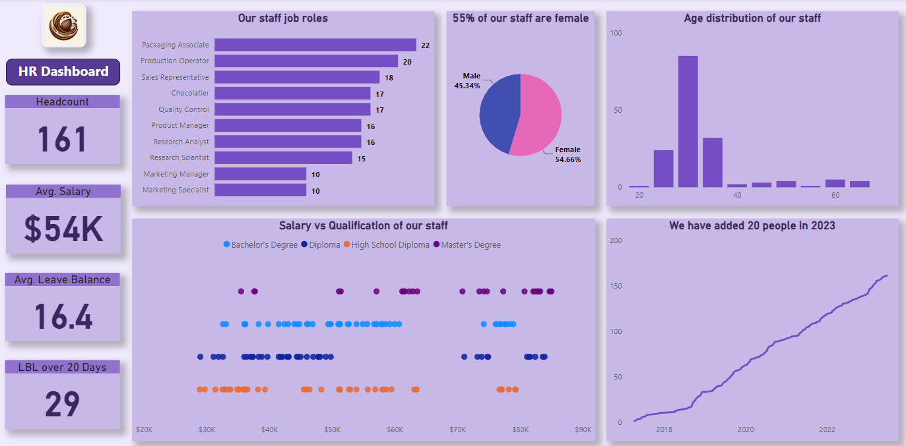
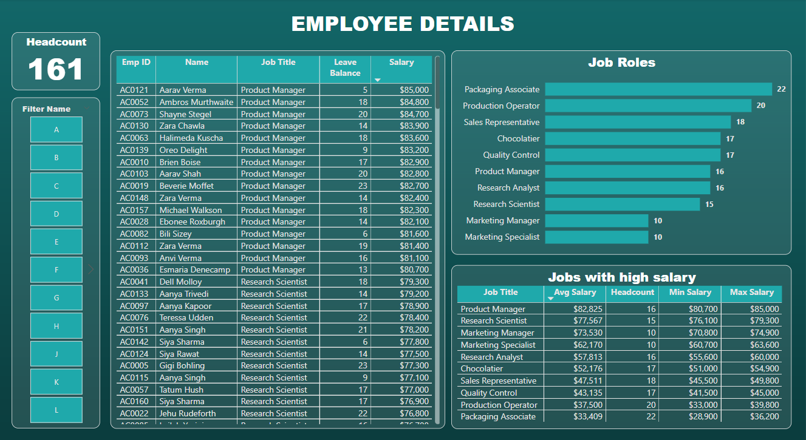
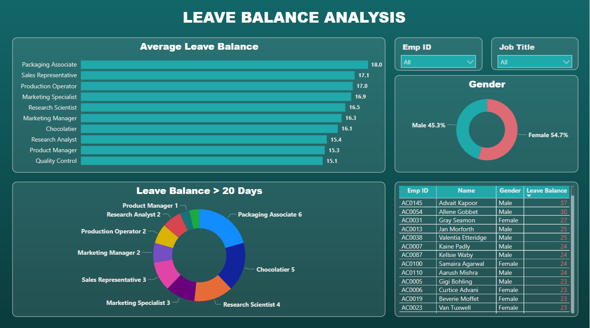

### HR Analytics Dashboard

In this project I have created an HR Analytics dashboard using PowerBI Desktop.

The steps followed are:
- Loading data into Power BI and cleaning it with Power Query
- Creating HR metrics like headcount, avg. salary, avg. leave balance etc.
- Comparing salary and education qualification
- Customizing visuals in Power BI (changing colours, axis, labels and legend)
- DAX calculations like cumulative headcount, leave balance more than 20 days
- Designing an HR dashboard with Power BI

The dashboard provides the following insights:
1) How many people are in each job?
2) Gender break-down of the staff
3) Age spread of the staff
4) Which jobs pay more?
5) Top earners in each job
6) Salary vs Qualification
7) Staff growth trend over time
8) Leave balance analysis